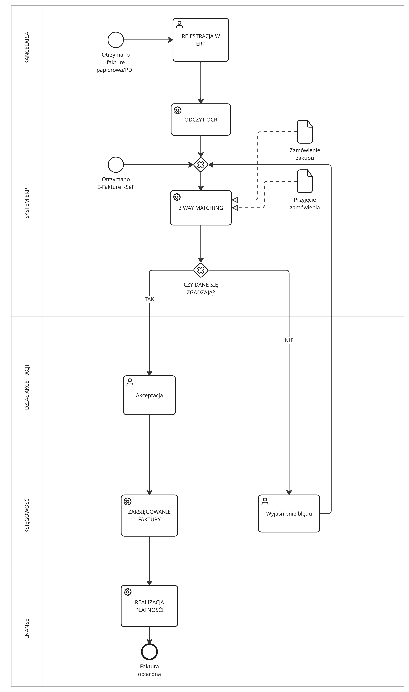
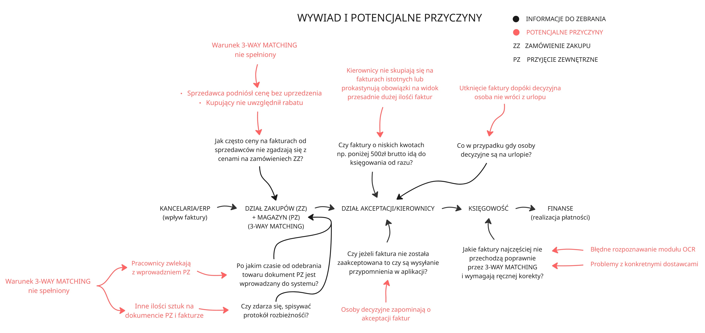
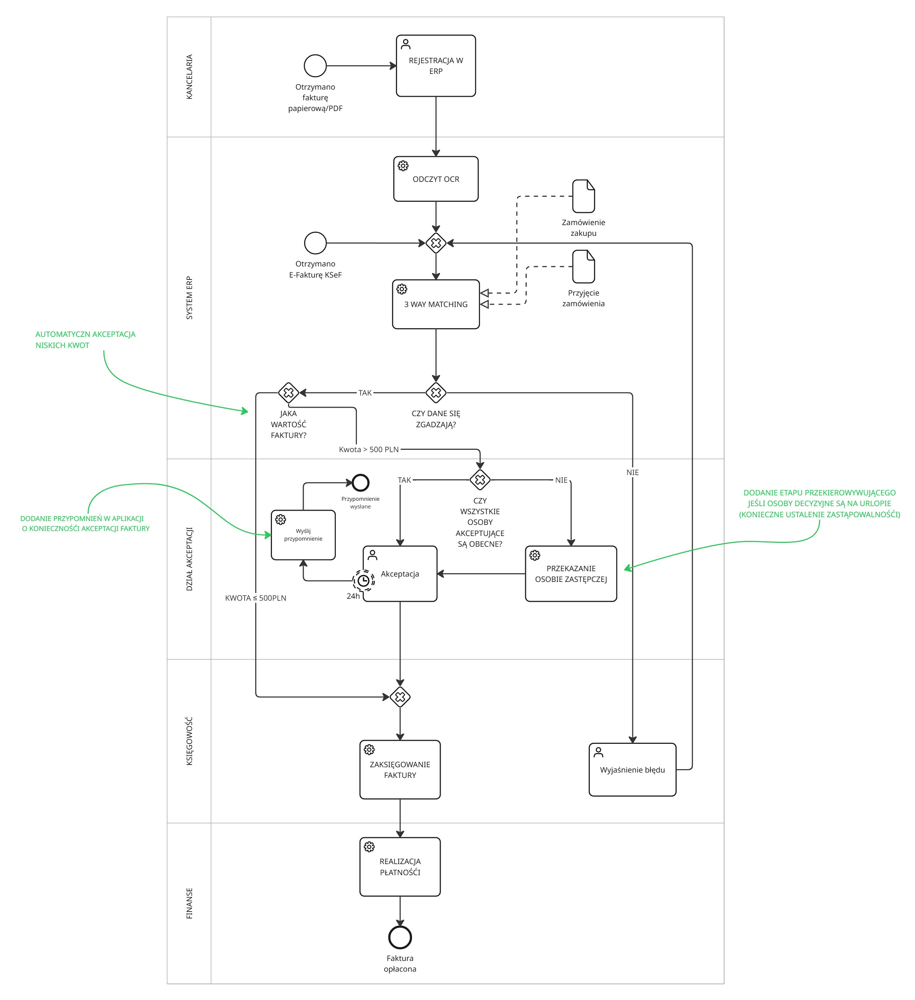
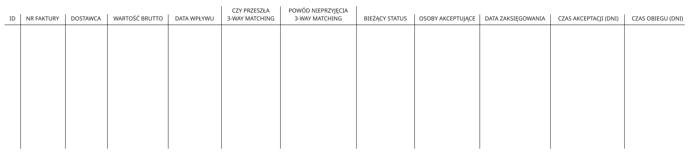
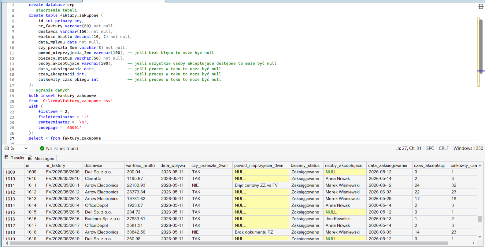
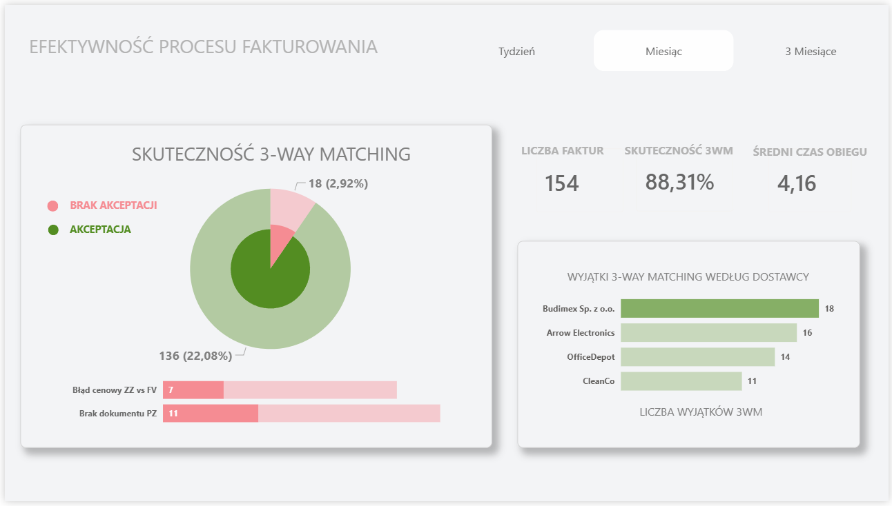
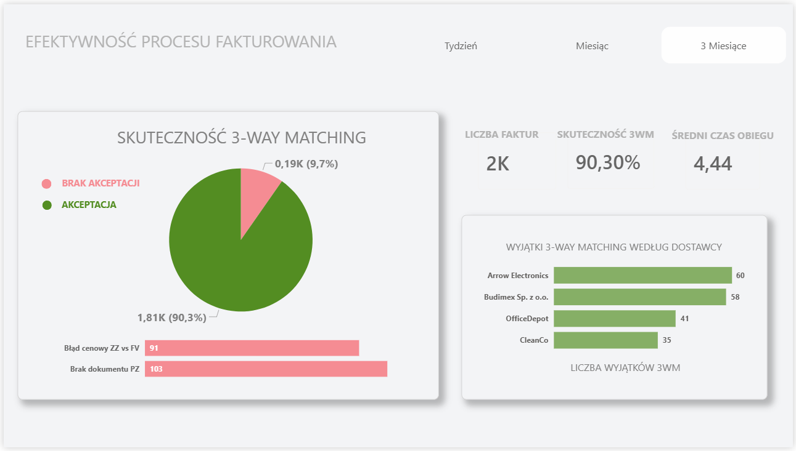

# Case study: Opóźnienia w księgowaniu faktur zakupowych

### Odtworzenie istniejącego procesu AS IS
Projekt rozpocząłem od odtworzenia procesu AS IS przebiegu faktury - poniżej proces w notacji **BPMN 2.0**

### Analiza procesu i próba znalezienia kluczowych bottleneck'ów

### Modelownie procesu TO BE wraz z uwzględnieniem usprawnień 
Po przeprowadzonym wywiadzie największym wąskim gardłem okazał się być dział akceptacji. Poniżej model TO BE wraz z uwzględnieniem usprawnień.

### Stworzenie datasetu do przyszłej analizy poprawionego procesu TO BE 
Na potrzeby projektu stworzyłem skrypt w pythonie [generate_dataset.py](scripts/generate_dataset.py) generujący dane do poniższego datasetu

### Stworzenie bazy danych na podstawie datasetu
Na podstawie wygenerowanych danych stworzyłem bazę danych w **MS SQL** i za pomocą bulk insertu zaimportowałem do niego dane

### Analiza w Power BI 
Łącząć się z bazą w Power BI stworzyłem interaktywny dashboard pozwalający na dalsze monitorownie przebiegu fakturowania

### Analiza dashboardów - wnioski i dalsze propozycje 
Po analizie dashboardów kolejnym wąskim gardłem okazał się być brak dokumentów PZ i rozbieżności cenowe na zamówieniach i fakturach. 

**Rozwiązanie braku dok umentów PZ** - wyposażenie magazynierów w skanery - po sczytaniu dokumentu WZ, system automatycznie generuje dokument PZ w bazie  

**Rozwiązanie rozbieżności cenowych**  - konieczność ponownego sprawdzenia szblonów do zamówień w systemie ERP, istnieje możliwość, że dostawcy gdzie najczęściej pojawiają się rozbieżności najliczają rabat powyżej konkretnej ilośći zamówionych sztuk danego produktu
